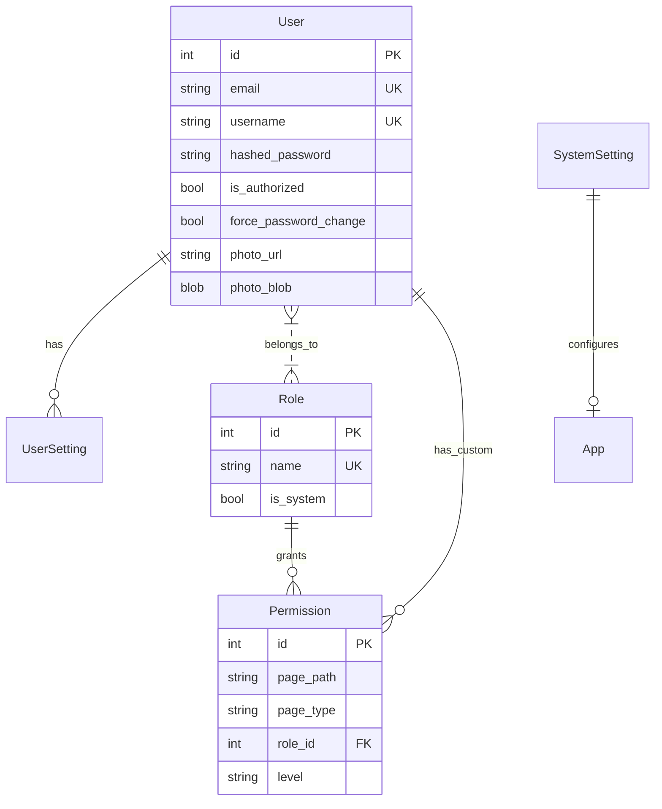

**Matika** | Version: **1.0.7** | Copyright (c) 2026 Patrick James Tallman

# Matika Technical Architecture & Design

## 1. Executive Summary
Matika is a high-performance, plugin-agnostic framework built with a modern, layered architecture. It provides a core foundation for authentication, Role-Based Access Control (RBAC), and dynamic UI layout, which can be extended via "AppLugs" (plugins). The framework is designed to have zero hardcoded knowledge of the applications it hosts, enabling a strictly decoupled development model.

## 2. The "No-Knowledge" Principle
The foundational rule of Matika is that the core repository must remain domain-agnostic. 
- **Core:** Handles user sessions, permissions, internationalization, and plugin discovery.
- **AppLugs:** Handle domain logic (e.g., financial tracking, security scraping, reporting).
- **Integration:** Matika discovers plugins at runtime via `applug.json` manifests and dynamically integrates their routes, models, and menu items.

## 3. Technology Stack
- **Backend:** [FastAPI](https://fastapi.tiangolo.com/) (Python 3.14+)
- **Database:** [SQLite](https://sqlite.org/) (default) or **PostgreSQL/MySQL** via [SQLAlchemy](https://www.sqlalchemy.org/) ORM
- **Authentication:** Direct **bcrypt** hashing (optimized for Python 3.14+)
- **Frontend:** [Jinja2](https://palletsprojects.com/p/jinja/) Templates, [TypeScript](https://www.typescriptlang.org/), Vanilla CSS
- **Tooling:** `uv` for Python environment, `npm` for TypeScript compilation, `pytest` for unit testing

## 4. Folder Structure (Standard src layout)
```
/
├── data/                   # Persistent storage (SQLite .db files)
├── doc/                    # Technical documentation
├── plugins/                # AppLug directory (kept empty in core repo)
├── scripts/                # Dev/Ops automation (release, milestone, sync)
├── src/                    # Source code root
│   ├── frontend/           # TypeScript source files
│   └── matika/             # Main Framework package
│       ├── auth/           # Authentication logic and dependencies
│       ├── core/           # AppLug service, paths, and constants
│       ├── data_mgmt/      # Export/Import logic
│       ├── locales/        # Core translation JSON files (en, es)
│       ├── metadata/       # Framework UI metadata
│       ├── static/         # Compiled JS, CSS, and uploaded assets
│       ├── templates/      # Base HTML templates (Jinja2)
│       ├── main.py         # Application entry point
│       └── models.py       # Core data models (User, Role, Permission)
└── tests/                  # Framework unit and integration tests
```

## 5. Component Architecture

### 5.1. AppLug Service (`core/applug_service.py`)
The framework's discovery engine. It handles:
- **Discovery:** Recursively scanning the `plugins/` directory.
- **Bootstrapping:** Dynamically importing entry point classes (extending `BaseAppLug`).
- **Integration:** Automatically mounting plugin routers and merging templates.
- **Provisioning:** Reading permission requirements from plugin manifests and auto-seeding roles.

### 5.2. Maintenance Activity Pattern
Administrative pages follow a standardized layout for consistency:
- **`maintenance_activity_base.html`:** Implements a two-vertical-panel layout (Browse vs. Maintenance).
- **AJAX Lifecycle:** Modifications are validated on the backend and refreshed on the frontend without full page reloads.

### 5.3. Internationalization Service (`i18n.py`)
Localization is handled by a merged-dictionary approach. At runtime, the `I18nService` combines core Matika strings with any locale overrides provided by active plugins.

## 6. Scalability & Distributed Architecture

While Matika is designed as a streamlined monolith, it follows cloud-native principles for high-availability scaling.

### 6.1. Component Decoupling
- **Frontend (Static Assets):** Compiled assets can be offloaded to Nginx, AWS S3, or a CDN (CloudFront).
- **Backend (API Service):** Stateless FastAPI application. Multiple instances can run behind a Load Balancer (Nginx, HAProxy, AWS ALB).
- **Database (Persistence):** Point `DATABASE_URL` to a central **PostgreSQL** or **MySQL** instance for multi-node setups.

### 6.2. Profile Photo Storage Strategy
Matika uses **Database BLOB Storage** for profile photos:
- **Portability:** Eliminates the need for persistent volume mounts (like Docker volumes) for user media.
- **Consistency:** Database backups automatically include all user assets.
- **Serving:** Served via a dedicated route (`/settings/user/photo/{user_id}`) with correct MIME type detection.

## 7. Data Model & Segregation

### 7.1. System vs. User Data
- **System Data (`is_system=True`):** Foundational roles (`Admin`, `User`), standard permissions, and baseline configurations. Protected from deletion to ensure framework stability.
- **User Data (`is_system=False`):** User accounts, personal settings, and domain-specific entities (provided by plugins).

### 7.2. Persistence Layer

*Note: Plugins extend this schema by creating their own tables (e.g., EyeRate's `securities` table) during their `on_load()` hook.*
